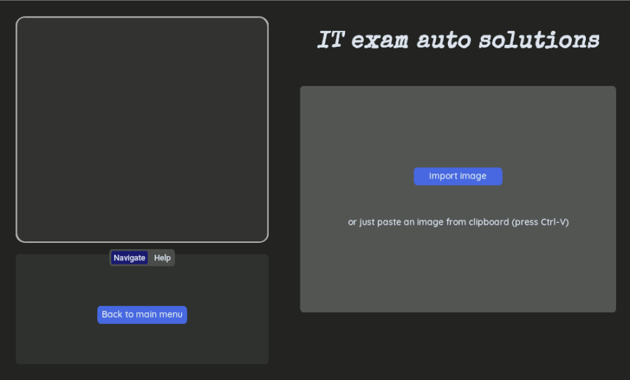
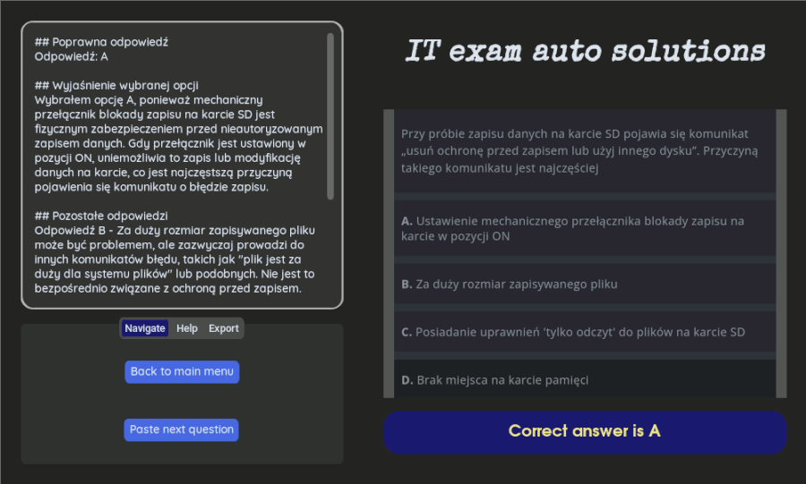

# AI-Powered solutions to multiple-choice questions

This project is a Python-based application designed to solve multiple-choice questions (A/B/C/D answers) using Bing AI through the `sydney-py` module. The application features a custom GUI built with `customtkinter` for a seamless user experience.

## Features

- **Multiple-Choice Question Solver**: Automatically solve questions with A/B/C/D answers.
- **Custom GUI**: Intuitive interface built with `customtkinter`.
- **OCR Integration**: Extract text from images using `pytesseract`.
- **AI-Powered Solutions**: Generate answers via Bing AI with `sydney-py`.
- **Image Processing**: Handle images using `Pillow`.
- **Export Functionality**: Save solutions to `.odt` files using `odfpy`.

## Screenshots




## Installation

> [!IMPORTANT]
> The GUI will look great only on linux machine (tested on Debian). There may be problems with the appearance of the application when using Windows.

To run the application locally:

1. **Clone the Repository**:

   ```sh
   git clone https://github.com/Gibirizon/solving-multiple-choice-questions-with-AI.git
   cd solving-multiple-choice-questions-with-AI
   ```

2. **Create a Virtual Environment**:

   ```sh
   python3 -m venv venv
   source venv/bin/activate  # On Windows use `venv\Scripts\activate`
   ```

3. **Install Dependencies**:

   ```sh
   pip install -r requirements.txt
   ```

4. **Run the Application**:
   ```sh
   python main.py
   ```

## Usage

1. **Input Questions**:

   - Enter screenshots of multiple-choice questions from your files or just paste them with Ctrl-V when your cursor is in appropriate area.

2. **Get Solutions**:

   - Click `Get an answer to your question` to get AI-generated answers.

3. **Export Solutions**:
   - Save answers to `.odt` files by navigating to `Export` tab.

---

Made by Gibirizon :heart:
