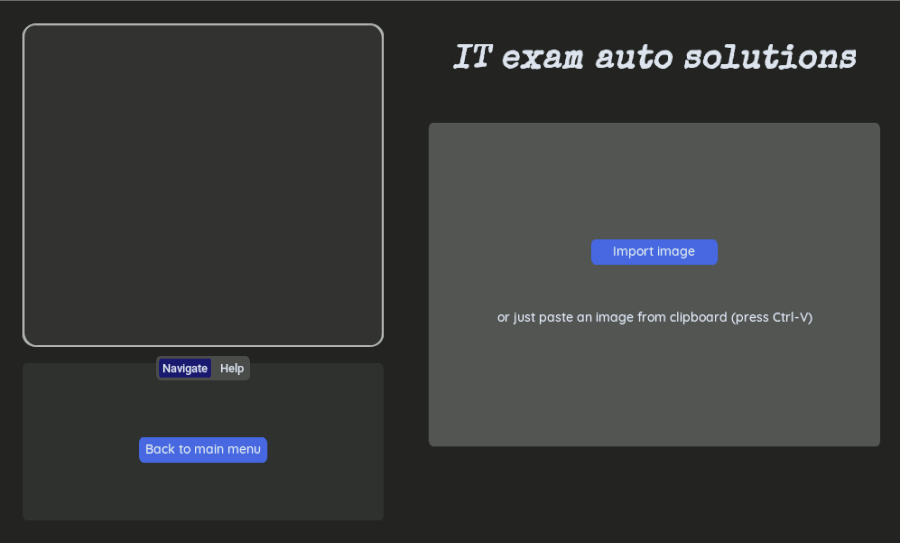
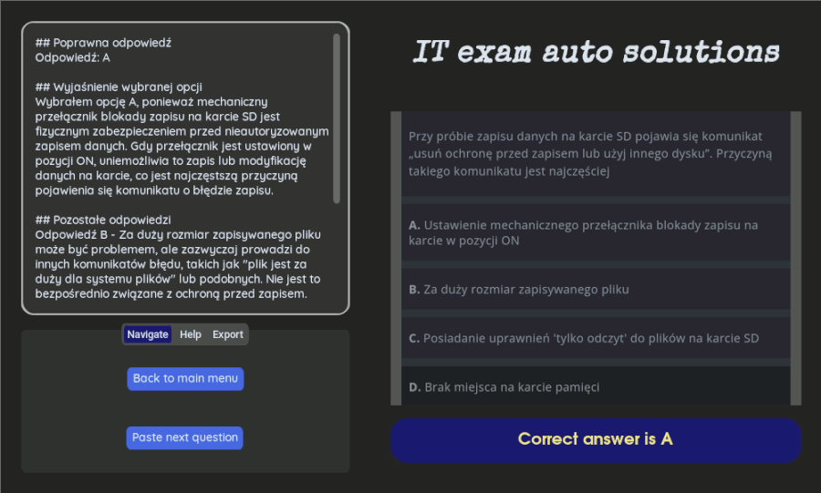

# AI-Powered solutions to multiple-choice questions

This project is a Python-based application designed to solve multiple-choice questions (A/B/C/D answers) using OpenRouter AI through the `openai` module. The application features a custom GUI built with `customtkinter` for a seamless user experience.

## Features

- **Multiple-Choice Question Solver**: Automatically solve questions with A/B/C/D answers.
- **Custom GUI**: Intuitive interface built with [customtkinter](https://github.com/TomSchimansky/CustomTkinter).
- **OCR Integration**: Extract text from images using [easyocr](https://github.com/JaidedAI/EasyOCR).
- **AI-Powered Solutions**: Generate answers via [OpenRouter AI](https://openrouter.ai/) with [openai api](https://platform.openai.com/).
- **Image Processing**: Handle images using [Pillow](https://pillow.readthedocs.io/en/stable/).
- **Export to files**: Save solutions to `.odt` files using [odfpy](https://github.com/eea/odfpy) or to markdown format `.md`.
- **Export to flashcard**: Save solution to [anki](https://apps.ankiweb.net/) for later revise and quicker learning.

## Screenshots




## Installation

> [!IMPORTANT]
> The GUI will look great only on linux machine (tested on Debian). There may be problems with the appearance of the application when using Windows.

To run the application locally:

1. **Clone the Repository**:

    ```sh
    git clone https://github.com/Gibirizon/solving-multiple-choice-questions-with-AI.git
    cd solving-multiple-choice-questions-with-AI
    ```

2. **Create a Virtual Environment and install dependencies**:

- For `pip` users:

```sh
python3 -m venv .venv
source .venv/bin/activate  # On Windows use `.venv\Scripts\activate`
pip install -e .
```

- For `uv` users:

```sh
uv sync
source .venv/bin/activate  # On Windows use `.venv\Scripts\activate`
```

3. **Run the Application**:

```sh
python main.py
```

## Usage

1. **Input Questions**:

    - Enter screenshots of multiple-choice questions from your files or just paste them with Ctrl-V when your cursor is in appropriate area.

2. **Edit the text or use image**:

- After importing screenshot of question you can edit the text taken from the photo with OCR or just use this screenshot directly to get better results.

3. **Get Solutions**:

    - Click `Get answer to your question` to get AI-generated answers.

4. **Export Solutions**:
    - Save answers to `.odt` or `.md` files by navigating to `Export` tab. You can also export this question as a flashcard to [anki](https://apps.ankiweb.net/) - powerful flashcards program. To export it to `anki` you need to have [AnkiConnect](https://ankiweb.net/shared/info/2055492159) add-on installed.

---

Made by Gibirizon :heart:
